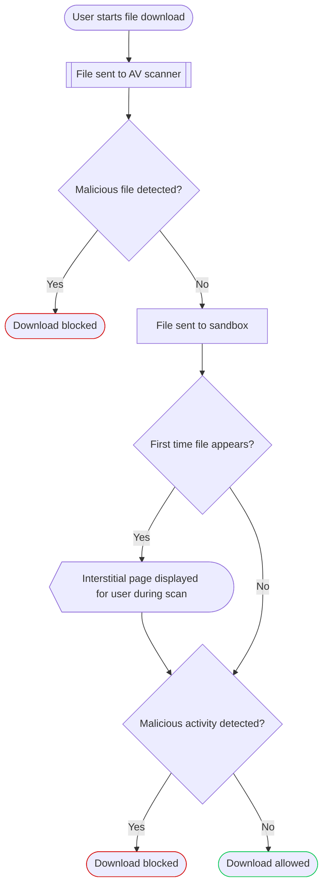

import { Render, Details } from "~/components";

:::note
Only available on Enterprise plans. For more information, contact your account team.
:::

In addition to [anti-virus (AV) scanning](/cloudflare-one/policies/gateway/http-policies/antivirus-scanning/), Gateway can quarantine previously unseen files downloaded by your users into a sandbox and scan them for malware.

When your users download a file, Gateway will first scan the file with AV scanning. If AV scanning detects malware, Gateway will block the download and log the result. If AV scanning does not detect malware, Gateway will send the file to the sandbox. While in the sandbox, Gateway will monitor the inputs and outputs of the file. While the files are quarantined, Gateway will present a scanning page to your users. If a file passes scanning, Gateway will release the file from quarantine and download it to your user's device. If the file contains malware, Gateway will block the request and log the match as a Block decision in your [HTTP logs](/cloudflare-one/insights/logs/gateway-logs/#http-logs).

## Get started

To begin quarantining downloaded files, turn on file sandboxing:

1. In [Zero Trust](https://one.dash.cloudflare.com), go to **Settings** > **Network**.
2. In **Firewall**, turn on **File sandboxing**.
3. (Optional) To block requests containing [non-scannable files](#non-scannable-files), select **Block requests for files that cannot be scanned**.

You can now create [Quarantine HTTP policies](/cloudflare-one/policies/gateway/http-policies/#quarantine) to determine what files to scan in the sandbox.

## Compatibility

### Supported file types

<Render file="gateway/sandbox-file-types" />

### Non-scannable files

<Render file="gateway/nonscannable-files" />
